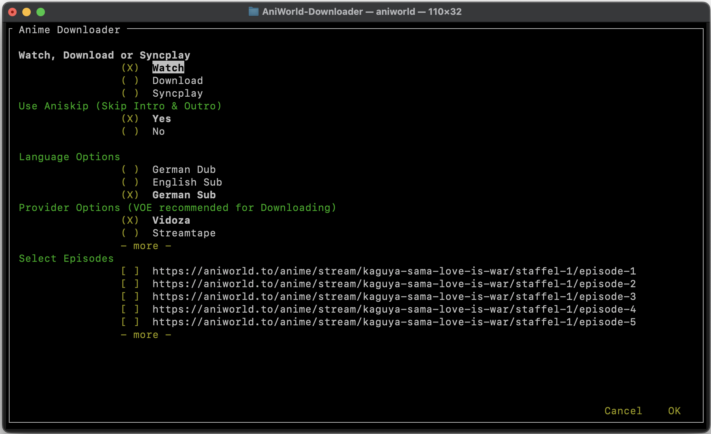

# AniWorld Downloader

## Description

AniWorld Downloader is a command-line tool for downloading and streaming content from aniworld.to.<br>
It can fetch single episodes, download entire seasons, and organize downloads into folders.<br><br>
This tool works on Windows, macOS, and Linux.



## Installation

To install AniWorld Downloader, use this command:

```shell
pip install -U aniworld
```

## Usage

To run AniWorld Downloader, use this command:

```shell
aniworld
```

## TODO

- [ ] Correct aniskip offset
- [ ] Refactor code into modular Python files
- [ ] Integrate Python logging module
- [ ] Utilize argparse for command-line argument parsing
- [ ] Implement functionality to fetch episode titles
- [ ] Develop comprehensive unit tests
- [ ] Configure Anime4K installation setup
- [ ] Support Doodstream
- [ ] Add proxy support
- [ ] Replace requests module with urllib

## Contributing

Contributions to AniWorld Downloader are welcome!<br>
Feel free to submit bug reports, feature requests, or pull requests to help improve the project.

## Credits

- mpv - https://github.com/mpv-player/mpv.git
- yt-dlp - https://github.com/yt-dlp/yt-dlp.git
- syncplay - https://github.com/Syncplay/syncplay.git

## License

This project is licensed under the MIT License.<br>
See the LICENSE file for more details.<br>

Thank you for using AniWorld Downloader!